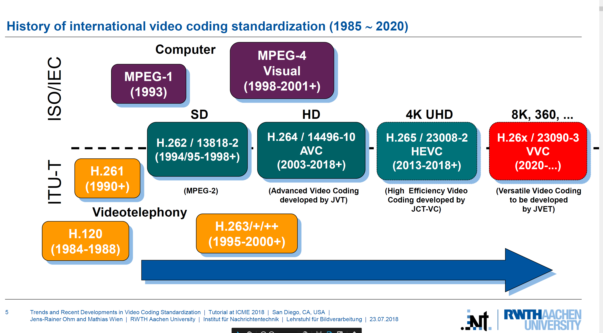

In this post, we are going through the key techniques using in video compresison algorithm such as (motion estimation, DCT transformation, quantization..). As you might know, the standards (MPEG-1,2,4; H264, H265(HEVC)) only defines the bitstream syntax and the
decoder behavior without defining the encoder. So, the principles of those techniques are used from the past standards to the state of the arts one.

<li><a href="/_posts/videoCodec.png">image</a></li>